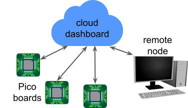

# Picogrid

[Maitreyee Marathe](maitreyeemarathe23@gmail.com), [Varun Balan](varunbalan30@gmail.com), Prof. Giri Venkataramanan   
University of Wisconsin-Madison

## Overview
The Picogrid is a low-cost low-power experimental platform for energy access and energy management modeling needs. The Picogrid platform consists of three layers, viz., Pico boards, a cloud dashboard, and a remote node as seen in the image below. 



These layers together form a small benchtop microgrid or a "picogrid" and emulate their real-world counterparts. Pico boards emulate prosumer households. The remote node emulates a load serving entity, DERMS (distributed energy resource management system), or a microgrid operator which can provide operating set points to the prosumers. The cloud dashboard emulates the data transfer system between the prosumers and the operator.  

## File organization
* pcb-files - contains Gerber files for building Pico boards and add-on modules
* embedded-software - code for Particle microcontroller on the Pico board
* cloud-dashboard - code for setting up cloud dashboard
* remote-node - contains sample code for sending setpoints from a remote node to the cloud dashboard

## Citation
Link and citation for our publication: [Picogrid: An experimental platform for prosumer microgrids](https://ieeexplore.ieee.org/abstract/document/10362891)   
```
@inproceedings{marathe2023picogrid,   
  title={Picogrid: An experimental platform for prosumer microgrids},   
  author={Marathe, Maitreyee and Venkataramanan, Giri},   
  booktitle={2023 IEEE Energy Conversion Congress and Exposition (ECCE)},   
  pages={718--725},   
  year={2023},   
  organization={IEEE}   
}
```

## Acknowledgments
We would like to thank Gabriela
Setyawan, Savannah Ahnen, and Shreya Mukherjee for their help in developing and testing the platform. This work was supported by the George Bunn Wisconsin Distinguished Graduate Fellowship provided by the University of Wisconsin-Madison and the Wisconsin Electric Machines and Power Electronics Consortium.
