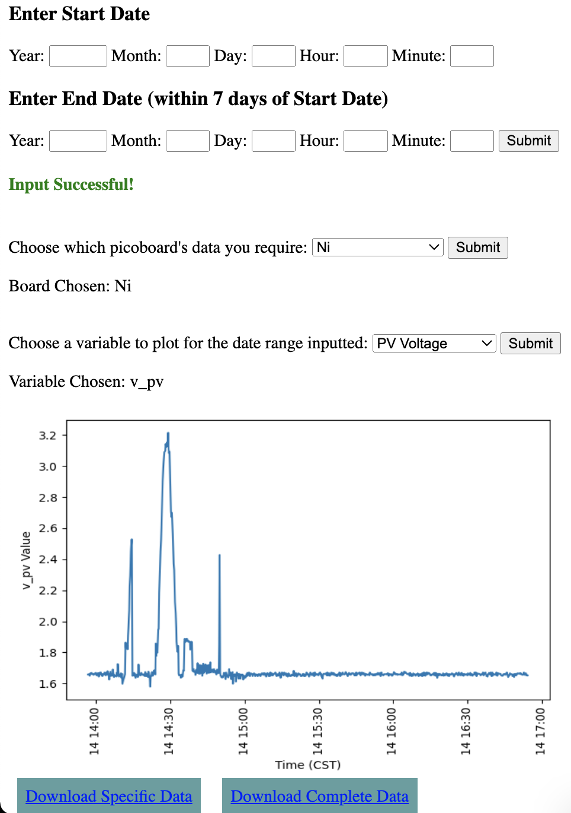
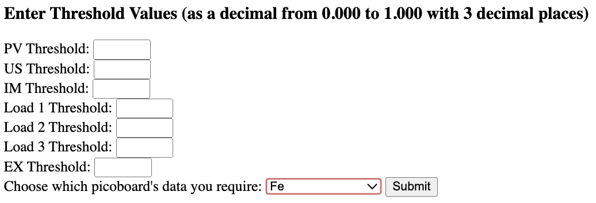

This platform is a web application developed with Python (+ [Flask](https://flask.palletsprojects.com/en/3.0.x/)) which interacts with [Particle Argon](https://docs.particle.io/argon/) boards (microcontrollers used in our hardware platform) and [Microsoft Azure](https://azure.microsoft.com/en-us) (the cloud provider used to develop to develop the platform)

## Folder structure
- **app.py**: the main backend code logic which decides what parts of the app the user sees based on user interaction
- **requirements.txt**: list of all the packages that were used in the project. Will use `pip` to download all the packages at once
- **static**: a temporary store to hold the data which the user retrieves and the plots that are generated (the files within these are deleted on each refresh of the app)
- **templates**: HTML pages with [Jinja](https://jinja.palletsprojects.com/en/3.1.x/) templating to dynamically show content based on user interaction with platform

## Cloud Dashboard Screenshots
The image below shows the data retrieval page of the dashboard. Users can get data out from specific Pico boards based on the time frames of their experiment in CSV format for further analysis.   

The image below shows the page that can be used to send setpoints (such as thresholds to actuate loads and sources) from the dashboard to the Pico boards. This enables users to make dynamic changes with minimal latency during experiments.   

## Setup
1. After downloading the code and [having pip installed](https://pypi.org/project/pip/), navigate to the folder in Terminal / PowerShell and run `pip install -r requirements.txt` to download all packages
2. Set up Azure IoT Hub and a Particle Integration to connect the Particle Argon to Azure using these [instructions](https://docs.particle.io/community/photon-maker-kit-workshop/ch3/)
3. Create an Azure Blob Storage Account using these [instructions](https://learn.microsoft.com/en-us/azure/storage/common/storage-account-create?toc=%2Fazure%2Fstorage%2Fblobs%2Ftoc.json&bc=%2Fazure%2Fstorage%2Fblobs%2Fbreadcrumb%2Ftoc.json&tabs=azure-portal) - make sure that public read access is not allowed
4. Route messages that come into Azure IoT Hub to the Blob Storage following these [instructions](https://azure.microsoft.com/en-us/blog/route-iot-device-messages-to-azure-storage-with-azure-iot-hub/) and this [reference](https://learn.microsoft.com/en-us/azure/iot-hub/tutorial-routing?tabs=portal)
5. Ensure that the messages are sent to Azure Blob Storage in JSON form using this [document](https://learn.microsoft.com/en-us/azure/iot-hub/tutorial-routing?tabs=portal#route-to-a-storage-account)
6. Grant read access to the Azure Storage Blob using an Azure Role Assignment in Azure Access Control (IAM). Add the `Storage Blob Data Reader` for the users that need to access the data
7. Create an Azure App Service to host the Python Flask App using these [instructions](https://learn.microsoft.com/en-us/azure/app-service/quickstart-python?tabs=flask%2Cwindows%2Cazure-cli%2Cazure-cli-deploy%2Cdeploy-instructions-azportal%2Cterminal-bash%2Cdeploy-instructions-zip-azcli)
8. Create a Managed Identity for the App Service in the Settings -> Identity Pane of the App Service and obtain the Object ID. Add this managed identity as an authorized `Storage Blob Data Reader` for the Azure Storage Blob (ensure secure access of the )
9. Go to Particle Access Tokens [Docs](https://docs.particle.io/reference/cloud-apis/access-tokens/) and generate an access token that does not expire. Create a secret in Azure Key Vault using instructions [here](https://learn.microsoft.com/en-us/azure/key-vault/secrets/quick-create-portal) and store the access token as a secret. You will need to ensure that `Key Vault Secrets User` role assignment (in the IAM pane) is added for the App Service Managed Identity + any users that will modify / add the secret.
10. In `config.py` follow the TODO tasks to populate the fields for the application to pull from the correct resources and credentials
