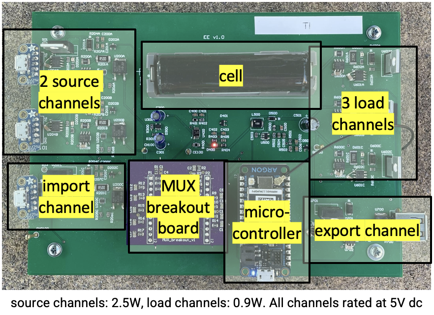

## Pico board PCB
The image below shows the Pico board with the major sections labelled.   

## File Organization
* pico-board - files for the Pico board
* mux-breakout - files for the MUX breakout board that is plugged into the Pico board
* junction-board - files for the board used to interconnect Pico boards
